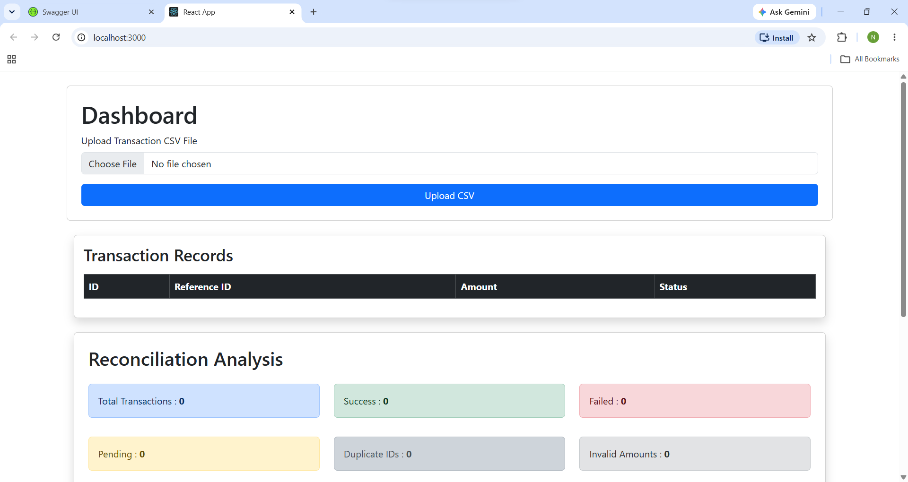

# Enterprise Transaction Reconciliation Platform

A full-stack enterprise-grade transaction reconciliation platform developed to automate transaction validation, reconciliation, monitoring, and reporting between uploaded transaction records.

The platform provides secure authentication using JWT, CSV file upload functionality, transaction search capabilities, reconciliation summary dashboards, and REST API documentation through Swagger UI.

---

## Live Demo
Frontend:
https://your-frontend-url.com

Backend Swagger:
https://your-backend-url/swagger-ui/index.html

---

## Demo Video

🎥 [Watch Project Demo Video](https://drive.google.com/file/d/1IFQcNwG1xnjCal4EXbDajM6WUZ8TruD0/view?usp=drivesdk)

---

## Features

### Backend Features

- Spring Boot REST APIs
- JWT Authentication & Authorization
- Role Based Access Control
- CSV File Upload Processing
- Transaction Reconciliation Engine
- Search Transactions API
- Exception Handling
- Swagger Documentation
- PostgreSQL Database Integration

### Frontend Features

- React Dashboard
- Transaction Search
- Reconciliation Summary
- Transaction Records Table
- Responsive User Interface
- API Integration

---

## Technology Stack

### Backend

- Java 17
- Spring Boot
- Spring Security
- JWT
- Maven
- PostgreSQL
- Swagger OpenAPI

### Frontend

- React JS
- JavaScript
- HTML
- CSS

### Tools

- IntelliJ IDEA
- VS Code
- Postman
- Git
- GitHub

---

## Project Architecture

```text
transaction-reconciliation-system
│
├── backend
│   ├── config
│   │   ├── JwtFilter.java
│   │   ├── JwtUtil.java
│   │   └── SecurityConfig.java
│   │
│   ├── controller
│   ├── dto
│   ├── entity
│   ├── enums
│   ├── exception
│   ├── repository
│   ├── service
│   │
│   └── ReconciliationSystemApplication.java
│
├── frontend
│   ├── components
│   │   ├── Navbar.js
│   │   ├── ReconciliationSummary.js
│   │   ├── SearchTransaction.js
│   │   └── TransactionTable.js
│   │
│   ├── pages
│   │   └── Dashboard.js
│   │
│   ├── App.js
│   ├── App.css
│   └── index.js
│
├── screenshots
│
└── README.md
```

---

## Screenshots

### Project Structure


---

### Dashboard

Transaction monitoring dashboard with reconciliation insights.



---

### Search Transactions

Search and filter transaction records.


---

### Transaction Records

View all uploaded transaction records.


---

### CSV Upload

Upload transaction data using CSV files.


---

### Swagger API Documentation

Interactive REST API testing using Swagger UI.


---

## API Documentation

Swagger UI

```text
http://localhost:9091/swagger-ui/index.html
```

---

## Authentication APIs

### Register User

```http
POST /auth/register
```

### Login User

```http
POST /auth/login
```

---

## Transaction APIs

### Upload CSV

```http
POST /transactions/upload
```

### Get Transactions

```http
GET /transactions
```

### Search Transactions

```http
GET /transactions/search
```

### Reconciliation Summary

```http
GET /transactions/reconciliation-summary
```

---

## Getting Started

### Backend Setup

```bash
cd backend
```

```bash
mvn clean install
```

```bash
mvn spring-boot:run
```

Backend runs on:

```text
http://localhost:9091
```

---

### Frontend Setup

```bash
cd frontend
```

```bash
npm install
```

```bash
npm start
```

Frontend runs on:

```text
http://localhost:3000
```

---

## Future Enhancements

- Export Reports to Excel
- Email Notifications
- Advanced Analytics Dashboard
- Cloud Deployment
- Audit Logging
- Multi-user Support

---

## Author

### Naveen Amalakanti

LinkedIn:

https://www.linkedin.com/in/naveen-amalakanti

Email:

naveenamalakanti07@gmail.com

---

## License

This project is developed for educational, learning, and portfolio purposes.